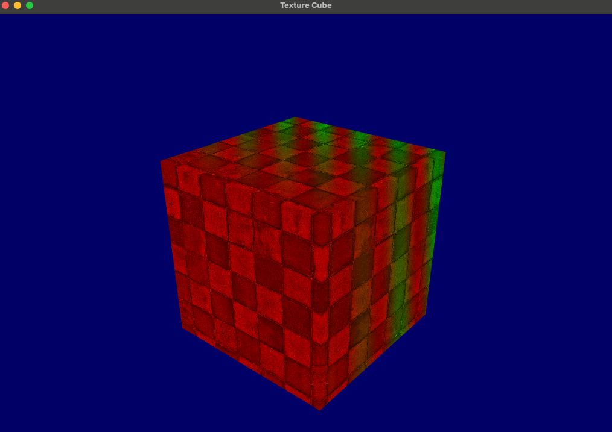

# Texture Cube

This project is a simple OpenGL application that renders a cube with a texture applied to it.



## Building the Project

To build the project, you will need to have CMake installed. You can download CMake from the [official website](https://cmake.org/download/).

Once you have CMake installed, you can build the project by running the following commands in the terminal:

```shell
mkdir build
cd build
cmake ..
make
```

This will generate an Xcode project in the `build` directory that you can open and run.

## Dependencies

The project uses the following dependencies:

- [GLFW](https://www.glfw.org/download.html)
- [GLAD](https://glad.dav1d.de)
- [GLM](https://github.com/g-truc/glm)